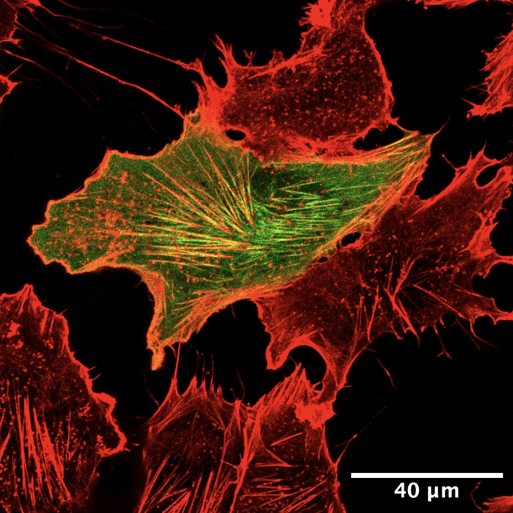

I'm an incoming graduate student in the Department of [Medical Biophysics](https://medbio.utoronto.ca) at the University of Toronto. I completed my undergraduate degree at U of T, where I studied [Computer Science](https://web.cs.toronto.edu) (with a *Focus in AI*) and [Biochemistry](https://biochemistry.utoronto.ca). I've taken advanced coursework in deep learning, computer vision, statistical learning, structural biology, bioinformatics, and more.

Currently, I'm working on developing a multi-omic model for predicting breast cancer subtypes, under the supervision of Dr. Alison Cheung at the [Biomarker Imaging Research Laboratory](https://research.sunnybrook.ca/facilities-and-research-groups/biomarker-imaging-research-laboratory/) and [Dr. Anne Martel](https://research.sunnybrook.ca/researchers/anne-martel/), both in the Sunnybrook Research Institute.

My current research interests are in 3D reconstruction, specifically in the context of the **cryo-EM problem**. My senior thesis aims to develop methodology to reconstruct membrane proteins embedded in their native lipid bilayer by using prior knowledge about their relative orientation. I'm co-supervised by [Dr. John L. Rubinstein](https://www.rubinsteinlab.org) at SickKids and [Dr. David J. Fleet](https://www.cs.toronto.edu/~fleet/) at Vector Institute. I'm mentored by [Shayan Shekarforoush](https://shekshaa.github.io), a PhD student at Vector Institute, and [Ryan Karimi](https://scholar.google.com/citations?user=ekl4WVEAAAAJ&hl=en), an MD/PhD student at UofT.

I've also been trained as a wet-lab scientist, and have experience in confocal fluorescence microscopy, tissue culture, and protein purification, done under the supervision of [Dr. Peter K. Kim](https://biochemistry.utoronto.ca/person/peter-k-kim/) at SickKids. In Dr. Kim's lab, I completed a summer research project and my junior thesis, where I looked at looked at translocation patterns of mitochondrial and peroxisomal proteins; and studied the fission machinery of mitochondria.

  <figure style="flex: 1; margin: 0 10px; display: flex; flex-direction: column; height: 100%;">
    <video width="100%" autoplay loop muted playsinline>
      <source src="/files/cryoMEM_VATPase.mp4" type="video/mp4">
      Your browser does not support the video tag.
    </video>
    <figcaption style="color: var(--text-color); margin-top: auto;">Figure 1: Reconstruction of (synthetic) V-ATPase found in a synaptic vesicle using the algorithm I'm developing.</figcaption>
  </figure>
  
  <figure style="flex: 1; margin: 0 10px; display: flex; flex-direction: column; height: 100%;">
    
    <figcaption style="color: var(--text-color); margin-top: auto;">Figure 2: HeLa cell stained for Phalloidin (red) and BORG3 (green) imaged using confocal fluorescence microscopy.</figcaption>
  </figure>

I'm more broadly interested in computational imaging, bioinformatics, and computational neuroscience, and will be pursuing post-graduate studies in (more than one of?) these fields.

My hobbies include playing basketball, trying coffee shops around Toronto, and playing the official format of the Pokémon videogame, [VGC](https://play.pokemonshowdown.com).

Please feel free to contact through any of the channels to the left.