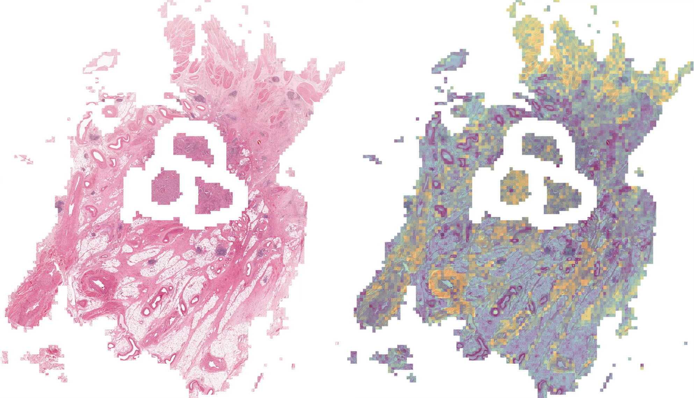

I'm a Master's student in the Department of [Medical Biophysics](https://medbio.utoronto.ca) at the University of Toronto where <u>I am currently completing rotations.</u> I completed my undergraduate degree at U of T, where I studied [Computer Science](https://web.cs.toronto.edu) (with a [Focus in AI](https://artsci.calendar.utoronto.ca/program/asfoc1689b)) and [Biochemistry](https://biochemistry.utoronto.ca). I've taken advanced coursework in deep learning, computer vision, statistical learning, structural biology, bioinformatics, computational biology, and more.

This past summer, I was an RA at the [Sunnybrook Research Institute](https://research.sunnybrook.ca/) and I worked on two projects. The first was developing a multi-omic model for predicting breast cancer subtypes and the second is predicting recurrence of bladder cancer using WSIs. I was grateful to be supervised by Dr. Martin Yaffe and Dr. Alison Cheung at the [Biomarker Imaging Research Laboratory](https://research.sunnybrook.ca/facilities-and-research-groups/biomarker-imaging-research-laboratory/) and [Dr. Anne Martel](https://research.sunnybrook.ca/researchers/anne-martel/).

A large research interest of mine during my undergraduate degree was the **cryo-em problem**. My senior thesis aimed to develop methodology to reconstruct membrane proteins embedded in their native lipid bilayer by using prior knowledge about their relative orientation. I was co-supervised by [Dr. John L. Rubinstein](https://www.rubinsteinlab.org) at SickKids and [Dr. David J. Fleet](https://www.cs.toronto.edu/~fleet/) at Vector Institute.

I was trained as a wet-lab scientist with experience in confocal fluorescence microscopy, tissue culture, and protein purification under [Dr. Peter K. Kim](https://biochemistry.utoronto.ca/faculty/peter-kim) at SickKids, where I completed a summer project and junior thesis on mitochondrial and peroxisomal protein translocation and mitochondrial fission.

  <figure style="flex: 1; margin: 0 10px; display: flex; flex-direction: column;">
    

      
    

    <figcaption style="color: var(--text-color); margin-top: 10px;">
      Figure 1: Resection of bladder cancer, with patches coloured according to risk of recurrence.
    </figcaption>
  </figure>

  <figure style="flex: 1; margin: 0 10px; display: flex; flex-direction: column;">
    

      <!-- <video width="100%" height="100%" autoplay loop muted playsinline style="object-fit: contain;">
        <source src="/files/cryoMEM_VATPase.mp4" type="video/mp4">
        Your browser does not support the video tag.
      </video> -->
      
    

    <figcaption style="color: var(--text-color); margin-top: 10px;">
      Figure 2: Reconstruction of (synthetic) V-ATPase found in a synaptic vesicle using the algorithm I developed.
    </figcaption>
  </figure>

  <figure style="flex: 1; margin: 0 10px; display: flex; flex-direction: column;">
    

      
    

    <figcaption style="color: var(--text-color); margin-top: 10px;">
      Figure 3: HeLa cell stained for Phalloidin (red) and BORG3 (green) imaged using confocal fluorescence microscopy.
    </figcaption>
  </figure>

I'm more broadly interested in computational imaging, bioinformatics, and computational neuroscience, among other fields.

My hobbies include reading, playing [basketball](https://www.gerdbizi.com/basketball), trying coffee shops around Toronto, and playing the official format of the Pokémon videogame, [VGC](https://play.pokemonshowdown.com).