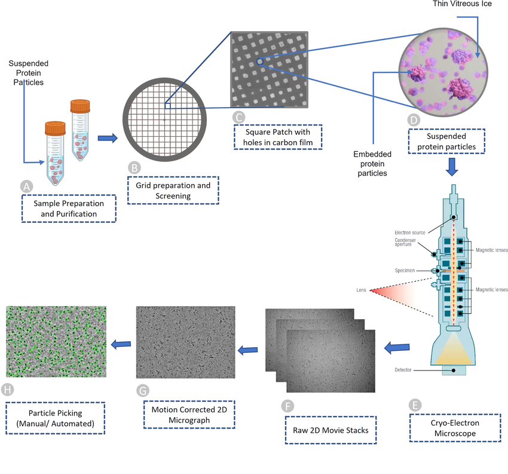

# tl;dr

I developed a method to reconstruct a 3D volume of a V-type ATPase, a membrane-embedded protein in synaptic vesicles, from cryo-EM images. A prior was established on each particle's in-plane and tilt angles by comparing their position relative to the centroid of the vesicles they were embedded in. This reduced the search space for the angle of each particle from \\(SO(3)\\), which has three DoF, to \\(SO(2)\\), which only has 1 DoF. This allowed for a more efficient search for the optimal orientation of each particle. This method was successfully evaluated on synthetic data and showed promision results on real data.

# Background

## Cryo-EM Background

Electron cryo-microscopy, or cryo-EM, is a technique used for the determination of the 3D structure of biomolecules, chiefly proteins. It uses a beam of electrons to image a thin frozen sample, and the resultant scattering of the electrons make up the image. While there may be *some* orientation bias for the particles in the vitreous ice, the particles' angles of rotation are random. To reconstuct, the rotation angles, those being:
1. In-plane angle (azimuthal angle), \\(\psi\\)
2. Tilt angle, \\(\theta\\)
3. Out-of-plane angle, \\(\phi\\)

must be determined.

<figure style="text-align: center;">
  
  <figcaption style="font-size:0.95em; margin-top:0.5em;">
    Figure 1: Schematic of cryo-EM sample preparation and imaging workflow. (Dhakal, 2023) [^1]
  </figcaption>
</figure>

[^1]: Dhakal, Ashwin & Gyawali, Rajan & Wang, Liguo & Cheng, Jianlin. (2023). A large expert-curated cryo-EM image dataset for machine learning protein particle picking. Scientific Data. 10. 10.1038/s41597-023-02280-2. 

